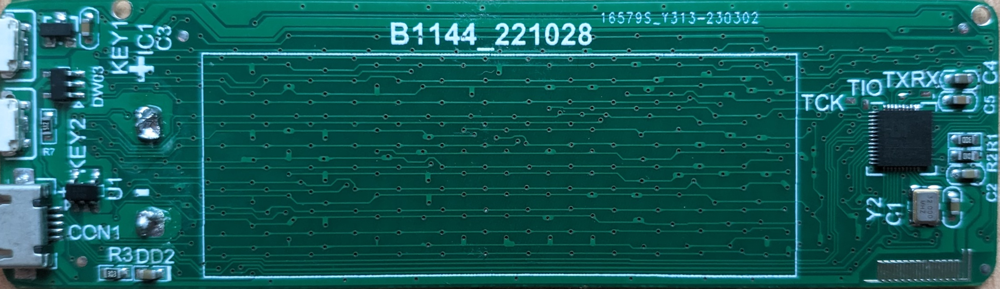
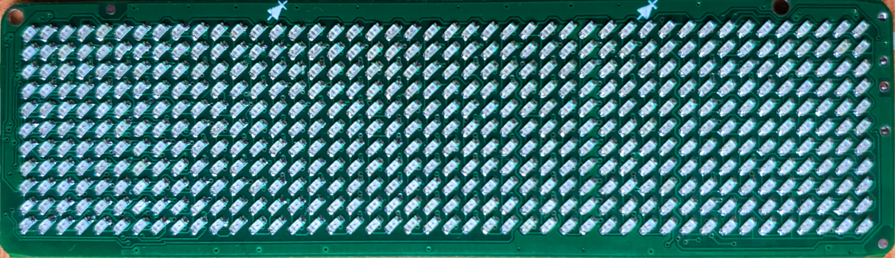

# CH582

* Chip is read protected for code sections
* Bootloader is active.
* BLE update seems deactivated
```
[INFO] Chip: CH582[0x8216] (Code Flash: 448KiB, Data EEPROM: 32KiB)
[INFO] Chip UID: C1-03-CC-26-3B-38-C8-62
[INFO] BTVER(bootloader ver): 02.40
[INFO] Current config registers: ffffffff23000000450fff4f
RESERVED: 0xFFFFFFFF
WPROTECT: 0x00000023
  [0:0]   NO_KEY_SERIAL_DOWNLOAD 0x1 (0b1)
    `- Enable
  [1:1]   DOWNLOAD_CFG 0x1 (0b1)
    `- PB22(Default set)
USER_CFG: 0x4FFF0F45
  [2:0]   RESERVED 0x5 (0b101)
    `- Default
  [3:3]   CFG_RESET_EN 0x0 (0b0)
    `- Disable
  [4:4]   CFG_DEBUG_EN 0x0 (0b0)
    `- Disable
  [5:5]   RESERVED 0x0 (0b0)
  [6:6]   CFG_BOOT_EN 0x1 (0b1)
    `- Enable
  [7:7]   CFG_ROM_READ 0x0 (0b0)
    `- Disable the programmer to read out, and keep the program secret
  [27:8]  RESERVED 0xFFF0F (0b11111111111100001111)
    `- Default
  [31:28] VALID_SIG 0x4 (0b100)
    `- Valid
```
## Hardware Details



Its mirrored front if you want to play with transparency:



### Pinouts reverse engineering

TBD

### Chip configuration

TBD

### Bootloader

To enter bootloader, you have to press the bottom button when plugging USB.

The bootloader will remain active for few seconds, waiting for upload.

Important: Because the badge reassigns the bootloader pin as GPIO after boot,
it is impossible to switch to bootloader as long as the battery is connected
to the board (the board is always powered and does not reset). To be able to
access the bootloader you must then desolder the battery.

## Development Hardware

* [WCH Link Debugger](https://www.aliexpress.us/item/3256803507003815.html)

* [CH58x development board](https://www.aliexpress.us/item/3256805118564658.html)

## Development software

* [WChisp firmware programmer](https://github.com/ch32-rs/wchisp)

* [CH583 Evaluation Board SDK](https://github.com/openwch/ch583)

* [Open Source Toolchain for CH582/CH583](https://github.com/cjacker/opensource-toolchain-ch32v)

