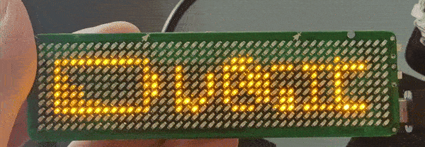

# badgemagic-firmware

Hardware details and information to build an open firmware for Bluetooth LED badges, compatible with [Badge Magic app](https://github.com/fossasia/badgemagic-app)

## Installation

### Unix
Install [wchisp](https://github.com/ch32-rs/wchisp?tab=readme-ov-file#installing).

Download prebuilt binaries from [release](https://github.com/fossasia/badgemagic-firmware/releases) or [the latest development builds](https://github.com/fossasia/badgemagic-firmware/tree/bin).

Make the chip enter bootloader mode (ISP mode) by power cycling the chip while
the boot pin is pulled down in one of two ways:

- Disconnect the battery, press and hold KEY2 (the button near the USB port)
  while plugging in the USB to enter the bootloader.
- Alternatively, connect the USB, press and hold KEY2, then short and release
  the C3 capacitor.

Then check `dmesg` if the chip has entered the ISP mode with idVendor=4348 and
idProduct=55e0.


Then run:

```sh
wchisp config reset
wchisp flash badgemagic-ch582.bin
```

### Windows
Install and run [wchisp studio](https://www.wch-ic.com/downloads/WCHISPTool_Setup_exe.html)
Connect the badge via USB and enter bootloader mode.

The device will automatically appear in the UI.

Select the `badgemagic-ch582.bin` file and click 'Download'.

Where badgemagic-ch582.bin is the binary downloaded above, the .elf file also
works.


## Usage

For usual usages, please refer to [badgemagic-app](https://github.com/fossasia/badgemagic-app) and [led-name-badge-ls32](https://github.com/fossasia/led-name-badge-ls32).

### Transferring Bitmap

#### over BLE

See [BadgeBLE.md](BadgeBLE.md).

#### over USB HID

From the device perspective, the data format is just the same as [the BLE Data
Format](BadgeBLE.md#data-format). The only difference is the data width. It's 64 bytes, while BLE, is only 16.

Located at Interface 0x00 and Endpoint 0x01. Interface Number and Enpoint Address might not be always fixed, any app using this should check them before using. 

For more detail about USB HID, please refer to [USB HID Device Class
Definition](https://www.usb.org/hid).

#### over USB CDC ACM

Similar to USB HID, but more convenient. From the host's perspective, it appears as a serial device, which can be interacted directly without the additional library. e.g. A `bitmap.bin` file with a format just like [the BLE Data Format](BadgeBLE.md#data-format) can be transferred to the badge by:

```sh
stty -F /dev/ttyACM0 raw && cat bitmap.bin > /dev/ttyACM0
```

For more detail about USB CDC ACM, see [Class definitions for Communication Devices 1.2](https://www.usb.org/document-library/class-definitions-communication-devices-12).

### Read firmware version from the badge

#### over BLE

This firmware was implemented following [the BLE Device
Information](https://www.bluetooth.com/specifications/specs/device-information-service-1-1/)
standard. Any device with BLE-capable can easily get the version by reading the
value of the Firmware Revision String Characteristic (0x2A26) in the Device
Information Profile (0x18A).

#### over USB

The version can be read from USB by reading the [USB Serial Number
String](https://www.usb.org/document-library/usb-20-specification).

#### from the screen

While the badge is in charging state, it display a animation followed by a
version repeatedly.



## Development

### Tools

- [GNU make](https://www.gnu.org/software/make/)
- [MounRiver Toolchain](http://file-oss.mounriver.com/tools/MRS_Toolchain_Linux_x64_V1.91.tar.xz)
- [wchisp](https://github.com/ch32-rs/wchisp)

### Build

Set the toolchain location, e.g.:

```sh
export PREFIX=../MRS_Toolchain_Linux_x64_V1.91/RISC-V_Embedded_GCC/bin/riscv-none-embed-
```

Simply run `make` to build the firmware for the Micro USB version, with the output directed to the `build/` directory. To build for the USB-C version of the badge and specify a custom output directory:

```sh
BUILD_DIR=custom-dir USBC_VERSION=1 make
```

> [!NOTE]
>
> Switching `USBC_VERSION` will require a clean build to make sure the new build
> does not contain the previous build blob. To rebuild:
>
> ```sh
> make clean all
> ```

To flash the firmware, enter the bootloader, then run:

```sh
BUILD_DIR=custom-dir-if-needed make isp
```

### Debugging

#### Logging over UART

Currently, only the UART1 with baudrate=921600 is used for debuging. To
enable the log from UART, set the DEUBG=1 when build the project.

Any USB to UART dongle will work. Use your favorite terminal emulator to see the
log, e.g.:

```sh
picocom -b921600 /dev/ttyUSB0 --imap lfcrlf
```

The [badgemagic-hardware](https://github.com/fossasia/badgemagic-hardware) have
this UART wired over USB-C. So it can be used without opening the case, but
required an [aditional hardware](https://oshwhub.com/mangogeek/typec) to split
the serial lines from USB-C.

#### Logging over USB CDC-ACM

This is convenient as it doesn't require additional hardware, but it may not be
useful for early logging when the USB is not yet initialized, and the user cannot open
the serial port quickly enough.

Use `cdc_tx_poll()` to log to this serial channel.

#### On-chip Debugging

This is a mystery.

### Add a new BLE Profile

To create a new custom data exchange channel, add a new BLE profile to the firmware
by duplicating `/src/ble/profile/legacy.c` and reconfig it. Rename
`xxx_registerService()` function. Call this function after `peripheral_init()` to
register your new profile.

For more detail of how to config a gatt service, see [BLE GATT](https://www.bluetooth.com/wp-content/uploads/Files/Specification/HTML/Core-54/out/en/host/generic-attribute-profile--gatt-.html).

### Add a new USB Composite Device

To add a new custom USB Composite Device (e.g., keyboard, mouse, speaker, etc.), duplicate `src/usb/composite/hiddev.c`. Rename and configure the file according to the Device Class you intend to implement, then call your device's `xxx_init()` function in `usb_start()` to initialize it. Each device class has specific specifications, so be sure to refer to them when implementing your new device.

## Hardware Information

BadgeMagic target hardware features a custom 11x44 LED matrix display, 
Bluetooth LE and low power consumption.

### Chipset

The design relies on a single MCU. 
MCU type has changed depending on manufacturer batches.

* ARM M0 variant based on [MM32L062PF](http://www.mindmotion.com.cn/en/download.aspx?cid=2564)
* ARM M0 variant based on [MM32W062](http://www.mindmotion.com.cn/en/download.aspx?cid=2564)
* RISC-V variant based on [CH582M](https://www.wch.cn/products/CH583.html)

See specific pages regarding each version of the hardware below

### Display

The custom 11x44 LED dot matrix displays using persistence of vision.

Bitmaps are drawn using 24 pins in [charlieplexing](https://en.wikipedia.org/wiki/Charlieplexing) technique.


## Firmware

Manufacturer firmware is closed source. Creating an open source compatible firmware is the goal of this project.

### Functionalities

The badge stores bitmaps with preconfigured animation sequences.
It uses 8 memory banks that can be used alternatively.

The 2 buttons configuration:

* Top button
    * Switches device on or off (long press)
    * Changes to Bluetooth upload mode (short press when on)
* Bottom button
    * Switches to badge display instead of charging screen when plugged with USB
    * Switches memory bank when displayed
    * Changes brightness level (long press)

### Upload Protocol

Here is some documentation on the [BLE package format](BadgeBLE.md). There still are some unclear parts, but it seems to work.

See original [led-name-badge-ls32](https://github.com/fossasia/led-name-badge-ls32) for USB update protocol reverse engineering

See [Badge Magic app](https://github.com/fossasia/badgemagic-app) for Bluetooth update protocol

#### Bluetooth Stack

```
Address 38:3B:26:CC:03:C1
Name LSLED
Class 0x0
Appearance 0x0
Device UUID 0000fee0-0000-1000-8000-00805f9b34fb
or 0000fee1-0000-1000-8000-00805f9b34fb
```

## Variant Specific Instructions

Currently, only the RISC-V version is targeted as it seems the only one produced at the moment.

### RISC-V CH582 Instructions 

Please go to [CH582 Badge Instructions and Reverse Engineering](CH582.md)


